<!-- =========================================================
     GitHub profile README — guilhermefontesdev
     Visual: pixel / retro, red + black.
     Pixel art lives next to this file (regenerate with: python gen_assets.py)
     ========================================================= -->

<p align="center">
  
</p>

<p align="center">
  
</p>

<p align="center">
  
  
  
</p>

<br/>

<!-- ============================ 01 ABOUT ============================ -->


I'm **Guilherme Viana Fontes**, a Software Engineering student at **UCSal** and a soon-to-be **Systems Development technician** from **SENAI CIMATEC**, based in Salvador, Bahia 🇧🇷.

I'm working toward becoming a **back-end developer**. I like building things from scratch and understanding *why* they work: what the JVM does with my code, how a query hits the database, how an API stays secure. My main stack is **Java** with **Spring**, and I've also shipped projects with **Node.js, Express, PostgreSQL and Supabase**, including an IoT energy platform that reads data from a real smart plug.

```java
public record Developer(String name, String role, String base) {}

var me = new Developer(
    "Guilherme Viana Fontes",
    "Back-end Developer (in training)",
    "Salvador, BA - Brazil"
);

me.focus("Java", "Spring Boot", "SQL", "REST APIs");
me.alsoBuildsWith("Node.js", "Express", "Supabase", "HTML", "CSS", "JavaScript");
me.motto("Build it from scratch. Understand why it works.");
```

> [!CAUTION]
> Work in progress. This profile, like its owner, gets refactored every day.

<br/>

<!-- ============================ 02 STACK ============================ -->


<p align="center">
  <b>BACK-END</b><br/><br/>
  
</p>

<p align="center">
  <b>FRONT-END &amp; TOOLS</b><br/><br/>
  
</p>

<p align="center">
  
  
  
  
  
  
</p>

<br/>

<!-- ============================ 03 PROJECTS ============================ -->


<!-- CONFIRA os links: troque pelo nome real de cada repositório -->
<p align="center">
  <a href="https://github.com/guilhermefontesdev/ecoflux"></a>
  <a href="https://github.com/guilhermefontesdev/psicogest"></a>
</p>

<br/>

<!-- ============================ 04 BUILDING NOW ============================ -->


<p align="center">
  <a href="https://github.com/guilhermefontesdev/nexusbank"></a>
  <a href="https://github.com/guilhermefontesdev/live-quiz"></a>
  <a href="https://github.com/guilhermefontesdev/hemocentro"></a>
</p>

<br/>

<!-- ============================ 05 LEARNING ============================ -->


```diff
- > ./learning --now

- [BACK-END]   Java in depth: OOP, constructors, static, JVM internals, garbage collection
- [BACK-END]   Spring Boot and building real REST APIs
- [DATABASE]   Data modeling (ER, conceptual + logical), SQL, JDBC with PostgreSQL
- [CLOUD]      AWS fundamentals: cloud concepts and observability
- [NETWORKS]   Computer networks, from the physical layer up
- [FRONT-END]  HTML, CSS and JavaScript, heading toward full-stack projects
```

<br/>

<!-- ============================ 06 STATS ============================ -->


<p align="center">
  
  
</p>

<p align="center">
  
</p>

<p align="center">
  
</p>

<p align="center">
  
</p>

<br/>

<!-- ============================ 07 EDUCATION ============================ -->


| | Course | Where | Status |
|:-:|---|---|---|
| ▸ | **B.Sc. in Software Engineering** | UCSal, Salvador | 2nd semester, in progress |
| ▸ | **Technical Degree in Systems Development** | SENAI CIMATEC | Finishing |

<br/>

<!-- ============================ 08 HOBBIES ============================ -->


<p align="center">
  
  
</p>

<br/>

<!-- ============================ 09 CONTACT ============================ -->


<p align="center">
  <!-- TROQUE "SEU-LINKEDIN" pelo final do link do seu perfil -->
  <a href="www.linkedin.com/in/guilherme-viana-dev"></a>
  <a href="mailto:guilherme.fontes.dev@gmail.com"></a>
</p>

<br/>

<p align="center">
  
</p>
